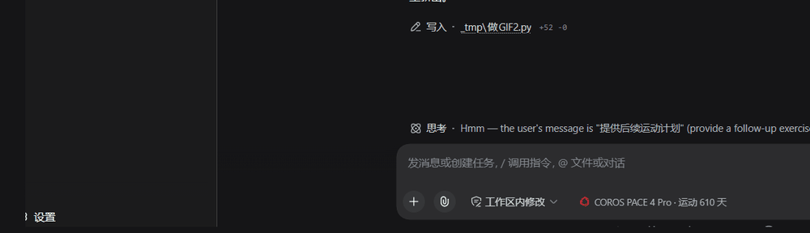

# dsh-coros-badge


The badge sits in the composer and expands to a one-line training review.

DeepSeek Harness（DSH）Web UI 插件：在输入框左侧常驻一个高驰徽章，实时展示**当前手表型号 + 累计运动天数**，点击展开**一句话点评 + 建议**。

- 数据来自本地已登录的 COROS MCP（`coros-mcp login` 缓存的 OAuth token），**不出本机**。
- 宿主侧内置 30 分钟缓存；点评/建议为轻量规则（近 30 天频率/距离 + 恢复度），不调用模型、零 token 费用。
- 自动识别登录区域（中国大陆 / 欧洲 / 美国），无需手动配端点。

## 前置条件

1. 已安装 [DeepSeek Harness](https://www.npmjs.com/package/@deepseek-ai/dsh) 并正常启动 `dsh web`。
2. 已通过 COROS 官方 CLI 完成登录（本插件读取它缓存的 token）：

   ```sh
   npm install -g coros-mcp
   coros-mcp login        # 浏览器授权一次即可
   ```

## 安装

```sh
dsh plugin add dsh-coros-badge
# 或本地目录：cd dsh-coros-badge && dsh plugin add .
# 或 tarball：dsh plugin add ./dsh-coros-badge-0.1.0.tgz
```

重启 `dsh web` 并刷新页面，输入框左侧即出现「高驰 Logo + 手表型号 · 运动 N 天」徽章。

## 区域说明

插件按 `~/.coros-mcp-skill-gateway-ts/` 下的地区目录（`cn`/`eu`/`us`）自动选择 COROS 端点。如需手动指定，可设置环境变量 `COROS_MCP_ISSUER`（例如 `https://mcpeu.coros.com`）。

## 卸载

```sh
dsh plugin remove dsh-coros-badge
```

## 发布 / 分发

本包带预构建产物、无运行时依赖、无构建脚本，可直接分发到三个平台：

- **npm**：`pnpm publish --access public`（用户安装：`dsh plugin add dsh-coros-badge`）
- **GitHub**：https://github.com/ZhangBo-cmd/dsh-coros-badge（用户安装：`dsh plugin add github:ZhangBo-cmd/dsh-coros-badge`）
- **Gitee**：https://gitee.com/ZhangBo-cmd/dsh-coros-badge

本地打 tarball：

```sh
pnpm pack   # 生成 dsh-coros-badge-0.1.0.tgz
```

## 目录结构

```
dsh-coros-badge/
├── package.json        # dsh.bundle + dsh.client(web)
├── cordis.patch.yml    # Loader 插入补丁
├── lib/
│   ├── index.js        # Host：/coros-summary 接口（读 token + 直连 COROS MCP）
│   └── client.js       # 浏览器：徽章 + 展开面板（高驰官方 Logo）
└── README.md
```

## 许可证

MIT

> 徽章内嵌的高驰 Logo 版权归 COROS（高驰）所有，仅用于识别用途。
